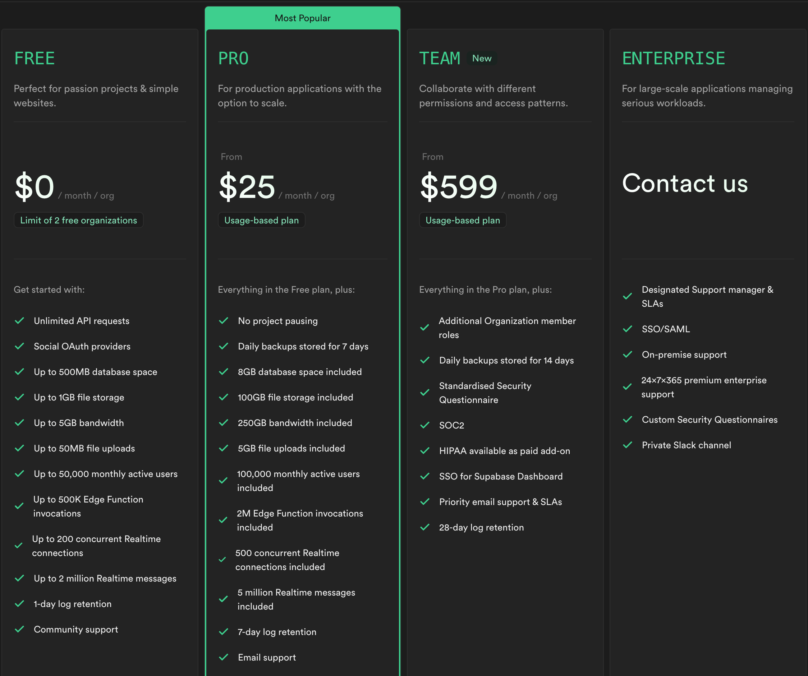

## Introduction

Supabase is an open-source BaaS (Backend as a Service) platform that was created in 2019 as an alternative to Firebase.
Supabase provides Postgres database, Authentication, instant APIs, Edge Functions, Realtime subscriptions, and Storage

## Brief History

- 2020 January: Supabase is started by Paul Copplestone and Ant Wilson.
- 2020 April: First update incl Postgres spin up, auto-generated API, query databases from dashboard and analyze queries.
- 2020 May: New UI, auto-generated docs for APIs, table view for the database.
- 2020 June: Migration to AWS, relational database UX, JSON editor and viewer, database backups, early version of Auth.
- 2020 July: Auth, new Postgres extensions.
- 2020 August: Email templates, custom SMTP server for Auth, TypeScript support.
- 2020 December: Supabase Beta and receiving of $6M in funding.
- 2021 March: Pricing (was entirely free before), storage, CLI, UI, workflows.
- 2021 September: Supabase raised $30M Series A.
- 2022 May: Supabase raised $80M Series B.
- 2023 May: Supabase Vector and ChatGPT plugins that support Postgres and

## Main Features

Supabase is a completely free open-source. Supabase offers a range of features that enable developers to build modern applications efficiently. Here are some of the key features of Supabase:

| Feature                          | Description                                                                                                                                                                                                                                                                                                                                  |
| -------------------------------- | -------------------------------------------------------------------------------------------------------------------------------------------------------------------------------------------------------------------------------------------------------------------------------------------------------------------------------------------- |
| Hosted Postgres database         | Allows to store and manage application's data. Postgres is a powerful, reliable, and feature-rich relational database system with a proven track record in the industry. Working with the Postgres tables inside Supabase takes a minimal understanding of SQL.                                                                              |
| Authentication and Authorization | A robust authentication and authorization system that allows to secure the application and control user access. User registration, login and password recovery can be easily managed using Supabase's authentication API's. Access control rules can be defined to restrict access to specific resources based on user roles and permissions |
| Auto-generated API's             | Supabase simplifies the process of building APIs for the application by automatically generating REST and GraphQL APIs based on the users database schema. It also enables seamless integration with front-end frameworks and libraries.                                                                                                     |
| Example Feature                  | This feature does something for a specific reason.                                                                                                                                                                                                                                                                                           |
| Example Feature                  | This feature does something for a specific reason.                                                                                                                                                                                                                                                                                           |
| Example Feature                  | This feature does something for a specific reason.                                                                                                                                                                                                                                                                                           |

## Market Comparison

This section can be used to compare the advantages and disadvantages of your chosen tool to other similar tools. You may use subheadings, tables or bullet points to structure your description.

If you are writing about an open source tool, it may be a good idea to compare it to similar proprietary tools. Likewise, if you are writing about a proprietary tool, it may be a good idea to compare it to similar open source tools.

Similarly, a self hosted tool and a cloud based tool with a similar purpose may make for a good comparison.

## Getting Started

If applicable, describe how to get started with your chosen tool. By providing examples, this can help to demystify a tool and make it more accessible to beginners.

## Pricing

## Conclusion

This section can be used to summarize your findings. What are the main advantages and disadvantages of your chosen tool? What are the main use cases for this tool? What are the main limitations of this tool? What does the future look like for this tool?

## References

- [Supabase Docs](https://supabase.com/docs)
- [Supabase: An Open Source Firebase Alternative](https://medium.com/@stackfoss/supabase-an-open-source-firebase-alternative-4075d2ca75e6)
- [Introduction To Supabase](https://www.adservio.fr/post/introduction-to-supabase)
- [Learn Supabase - freecodecamp full tutorial for beginners](https://www.youtube.com/watch?v=dU7GwCOgvNY)
